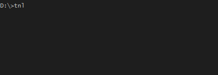

# tnl: simple secure tunnel to a local directory

`tnl` is a quick and easy way to create a public url with a secure tunnel to a local directory. Utilizing [ngrok](https://ngrok.com/) and [http-server](https://github.com/indexzero/http-server), within three characters you can have your directory forwarded to the outside. Excellent for testing on mobile as well as fast feedback from clients.

## Installation

Using `npm`:

     npm install tnl -g

It is now installed globally and `tnl` can be used in any directory from the command line.

## Usage

     tnl [options]

By default `[options]` are *optional*. 
For example, to change the default port and open in a new browser window immediately:

    tnl -p 7001 -o

### Using locally

     node bin/tnl

## Available Options

For a complete list of options refer to `http-server`'s [avalable options](https://www.npmjs.com/package/http-server#available-options).

`-o` Open browser window after starting the server

`-p` Port to use (defaults to 8080)

`-a` Address to use (defaults to 0.0.0.0)

`-d` Show directory listings (defaults to 'True')

`-i` Display autoIndex (defaults to 'True')

`-e` or `--ext` Default file extension if none supplied (defaults to 'html')

`-s` or `--silent` Suppress log messages from output

`--cors` Enable CORS via the Access-Control-Allow-Origin header

`-c` Set cache time (in seconds) for cache-control max-age header, e.g. -c10 for 10 seconds (defaults to '3600'). To disable caching, use -c-1.

`-P` or `--proxy` Proxies all requests which can't be resolved locally to the given url. e.g.: -P

